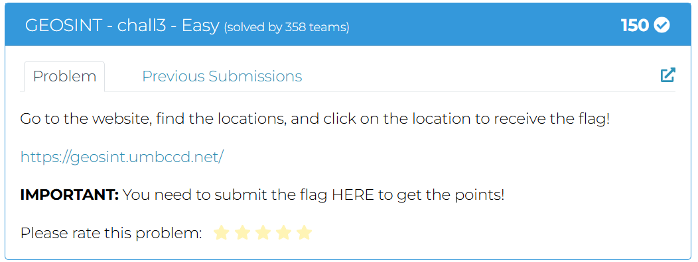

# <u>DawgCTF</u>
## Organized by the UMBC Cyberdawgs, sponsored by MetaCTF.

# Discord Challenge


## Solution

The flag is on the Discord Server

The Flag is : `DawgCTF{3nj0y_th3_c0mp3t1t10n!}`


# Challenge Files


## Solution

Clone the github repo `https://github.com/UMBCCyberDawgs/dawgctf-sp25` to your local system and then click on the `Hint` i.e. `?` button.

The Flag is : `DawgCTF{woah_files?}`


# Dont't Forget About the Hints!


## Solution

Press the hint button.

The Flag is : `DawgCTF{nice_job_thats_the_hint}`


## Don't Touch My Fone


## Solution

Given an audio file `dtmf.wav`

It is a Dial Tone

using `https://dtmf.netlify.app/`

We get the phone number as `4104553500`

The Flag is : `DawgCTF{4104553500}`


## The Birds


It is Birds Encryption
`https://www.dcode.fr/birds-on-a-wire-cipher`


matching the birds gives us `there_is_no_escape`

The Flag is : `DawgCTF{there_is_no_escape}`


# Mystery Signal 1


## Solution

It is a Morse Code, Using Morse Decoder `https://morsecode.world/international/decoder/audio-decoder-adaptive.html`

Gives us `L I S T E N C A R E F U L L Y`

The Flag is : `DawgCTF{LISTENCAREFULLY}`


# Interns Project


## Solution

Using input `1 2` gets the flag.

The Flag is : `DawgCTF{B@d_P3rm1ssi0ns}`


## Magnum Opus


## Solution

Using PGN Decoder on Lichess we get 

The games is `https://www.chessgames.com/perl/chessgame?gid=1011478` `https://lichess.org/study/E7Nhhgzp/nFiWBggC`

The games name is `Kasparov's Immortal`

Removing the `'` and using `_` instead of `space` gives us the flag.

The Flag is : `DawgCTF{Kasparovs_Immortal}`


# Es ist alles in Butter


## Solution

Using google translator to translate the text to english gives us

```
My friend and I were strolling through a shopping mall during our visit to Germany. While we were there, we got very hungry and decided to go to a supermarket to buy some fresh bread and kebabs. When we got to the store, we were pleasantly surprised to find that they had a bread slicer! It was very convenient. We wanted to go back, but we had forgotten where the store was! Stupid Americans, aren't we? Anyway, we got lucky because my friend happened to be taking a photo in the area because he liked the architecture. Can you help us find the supermarket so we can buy some fresh bread before we fly back?
```

Using Google Lens on the image provided gives us this place: `https://www.google.com/maps/place/Schultheiss-Quartier/@52.5271961,13.3429913,203m/data=!3m2!1e3!5s0x47a8510ad7d3bf4f:0x39bc4007bb7945c0!4m6!3m5!1s0x47a8510b285c4e0b:0x193c887b7be5974d!8m2!3d52.5274517!4d13.3438874!16s%2Fg%2F11gh03rv_d!5m1!1e1?entry=ttu&g_ep=EgoyMDI1MDQxNi4xIKXMDSoASAFQAw%3D%3D`


Now searching for `Bread shop nearby` gives us `https://www.google.com/maps/place/Kaufland+Berlin-Moabit/@52.5288537,13.3338843,2293m/data=!3m3!1e3!4b1!5s0x47a8510ad7d3bf4f:0x39bc400745f01e40!4m6!3m5!1s0x47a8516628051c6f:0xc1dfb6a1afe57e76!8m2!3d52.5288541!4d13.3441626!16s%2Fg%2F11f8jkcpr7!5m1!1e1?entry=ttu&g_ep=EgoyMDI1MDQxNi4xIKXMDSoASAFQAw%3D%3D`

The name is `Kaufland Berlin-Moabit`

The Flag is : `DawgCTF{Kaufland_Berlin-Moabit}`


# Suspicious Script


## Solution

It is Base64 Encoding from Cipher identifier, Decoding it gives us something like this in the middle of the text. `https://www.dcode.fr/cipher-identifier`

`}!5tp1c5_depp4rW{FTCgwaD`

Reversing gives us the flag

```Python
'`}!5tp1c5_depp4rW{FTCgwaD`'[::-1]
```

The Flag is : `DawgCTF{Wr4pped_5c1pt5!}`


# Look Long and Prosper


## Solution

From description we get this wikipedia webpage `https://discord.com/channels/782164200331018300/1362838617223069977/1362838617223069977`

Now Reading the first letter of every sentence gives us the `PADAWAN`

Now using it as a key in Vigenere Cipher gives us the flag


The Flag is : `DawgCTF{live_long_and_edit}`


# Spectral Secrets


## Solution

Using Audacity

The Flag is : `DawgCTF{4ud4c17y_my_b3l0v3d}`


# GEOSINT - chall1 - Easy


## Solution


The Flag is : `DawgCTF{Im-more-of-a-bama-fan}`


# GEOSINT - chall2 - Easy


## Solution


The Flag is : `DawgCTF{HaveUTriedCatFood?ihave!}`


# GEOSINT - chall3 - Easy



## Solution


The Flag is : `DawgCTF{ifsomeoneorders@HappyCamper_KFC_delivery-illgive10000points}`


# GEOSINT - chall4 - Easy


## Solution


The Flag is : `DawgCTF{was_this_actually_easy?}`


# GEOSINT - chall5 - Easy


## Solution


The Flag is : `DawgCTF{howmanyofyoujustknewitwasbaltimore?}`


# GEOSINT - chall6 - Medium


## Solution


The Flag is : `DawgCTF{wow_feels_christmas!}`


# GEOSINT - chall7 - Medium


## Solution

The Flag is : `DawgCTF{montereybay_itisnot}`


# GEOSINT - chall8 - Medium 


## Solution


The Flag is : `DawgCTF{goodol'missouray}`


# GEOSINT - chall9 - Medium


## Solution


The Flag is : `DawgCTF{UwUitsaflag}`


# GEOSINT - chall10 - Hard


## Solution


The Flag is : `DawgCTF{ifyoudidthiswithoutapanoID--goodforyou}`


# GEOSINT - chall11 - Hard


## Solution

The Flag is : `DawgCTF{looksatthepenguinz!}`


# GEOSINT - chall12 - Hard


## Solution

The Flag is : `DawgCTF{t.r.a.i.n.s}`


# My Cat Trashed My File!


## Solution

Given `cat.txt` and `spaghetti.txt`.

`cat.txt` is the commands that are to be run on `vi` editor on Linux on the `spaghetti.txt` file.

The Flag is : `DawgCTF{pAwsibiLiti3s_ar3_m30wV3l0us}`


# Caddyshack


## Solution


The Flag is : `DawgCTF{60ph3r_15_n07_d34d!}`


# Evanesco


## Solution


```
\xf3\xa0\x80\x81\xf3\xa0\x81\x84\xf3\xa0\x81\xa1\xf3\xa0\x81\xb7\xf3\xa0\x81\xa7\xf3\xa0\x81\x83\xf3\xa0\x81\x94\xf3\xa0\x81\x86\xf3\xa0\x81\xbb\xf3\xa0\x81\xb5\xf3\xa0\x81\x9f\xf3\xa0\x81\xa3\xf3\xa0\x81\xa1\xf3\xa0\x81\xae\xf3\xa0\x81\x9f\xf3\xa0\x81\xb4\xf3\xa0\x81\xa1\xf3\xa0\x81\xa7\xf3\xa0\x81\x9f\xf3\xa0\x81\xa2\xf3\xa0\x81\xb5\xf3\xa0\x81\xb4\xf3\xa0\x81\x9f\xf3\xa0\x81\xb5\xf3\xa0\x81\x9f\xf3\xa0\x81\xa3\xf3\xa0\x81\xa1\xf3\xa0\x81\xae\xf3\xa0\x81\xb4\xf3\xa0\x81\x9f\xf3\xa0\x81\xa8\xf3\xa0\x81\xa9\xf3\xa0\x81\xa4\xf3\xa0\x81\xa5\xf3\xa0\x81\xbd\xf3\xa0\x81\xbf
```

Decoding this we get
```
U+E001
U+E044
U+E061
U+E077
U+E067
U+E043
U+E054
U+E046
U+E07B
U+E075
U+E05F
U+E063
U+E061
U+E06E
U+E05F
U+E074
U+E061
U+E067
U+E05F
U+E062
U+E075
U+E074
U+E05F
U+E075
U+E05F
U+E063
U+E061
U+E06E
U+E074
U+E05F
U+E068
U+E069
U+E064
U+E065
U+E07D
U+E07F
```

Now using Simple Substitution
```
U+E001 => 1
U+E044 => 68
U+E061 => 97
...
```
```
1
68 => 'D'
97 => 'a'
119 => 'w'
103 => 'g'
67 => 'C'
84 => 'T'
70 => 'F'
123 => '{'
117 => 'u'
95  => '_'
99  => 'c'
97  => 'a'
110 => 'n'
95  => '_'
116 => 't'
97  => 'a'
103 => 'g'
95  => '_'
98  => 'b'
117 => 'u'
116 => 't'
95  => '_'
117 => 'u'
95  => '_'
99  => 'c'
97  => 'a'
110 => 'n'
116 => 't'
95  => '_'
104 => 'h'
105 => 'i'
100 => 'd'
101 => 'e'
125 => '}'
127 => DEL (ignore or remove)
```

Gives us the flag.


The Flag is : `DawgCTF{u_can_tag_but_u_cant_hide}`


# ASK Me Again


## Solution

using `inspectrum`

We allign the Signal correctly to the correct sample rate and then read as Binary
`Red -> 1`
`Black -> 0`


The Flag is : `DawgCTF{D3M0DUL4710N_1S_FUN}`


# Baby RSA 1


## Solution

The Flag is : `DawgCTF{wh0_s41d_m4th_15_us3l3ss?}`


# Baby RSA 2


## Solution

The Flag is : `DawgCTF{kn0w1ng_d_1s_kn0w1ng_f4ct0rs}`


# Cantor's Pairadox


## Solution

The Flag is : `Dawg{1_pr3f3r_4ppl3s_t0_pa1rs_4nyw2y5}`


# Just Parry Lol


## Solution

Using Dogbolt Decompiler `https://dogbolt.org/`

We can see that we get extra powers if we can get `You Feel Faster` which is done by giving a specific name.

The name is `AUTOPARRY`

Then doing double attack with `Parry` i.e. pressing `5` and again `5` we get the flag.

The Flag is : `DawgCTF{fr4me_d4ta_m4nipulat10n}`


# PinPoint1


## Solution


Trying the 3 possible keys

The Flag is : `DawgCTF{7901}`


# PinPoint 2


## Solution


The Flag is : `DawgCTF{512}`


# Lydia's New Code


## Solution

The Flag is : `DawgCTF{Cr03suS_w0u1d_B_pr0ud}`


# Guess Me If You Can


## Solution


The Flag is : `DawgCTF{PRNGs_d0nt_m4k3_f0r_g00d_p455w0rd5}	`


# The Fractalist


## Solution

Using this Python code gives us the flag

```Python
# Full Python code to extract the flag using escape time method (Fractalist-style)

# Step 1: List of complex numbers (from the challenge)
complex_strings = [
    "-1.2499999999999993-0.03999999999999925i",
    "-0.4199999999999986+0.6000000000000011i",
    "-0.24999999999999845-0.6399999999999997i",
    "-1.2099999999999993-0.16999999999999926i",
    "0.08000000000000164-0.6299999999999997i",
    "0.3600000000000018-0.3199999999999994i",
    "0.3300000000000018+0.520000000000001i",
    "-0.16999999999999837+0.6500000000000011i",
    "-0.23999999999999844+0.7500000000000012i",
    "-0.6999999999999988-0.26999999999999935i",
    "-0.5699999999999987+0.5700000000000011i",
    "-0.5499999999999987-0.6499999999999997i",
    "-0.5699999999999987-0.49999999999999956i",
    "-0.7099999999999989+0.29000000000000087i",
    "-0.36999999999999855-0.6399999999999997i",
    "-0.7499999999999989+0.030000000000000755i",
    "-1.2599999999999993-0.08999999999999925i",
    "-1.0099999999999991+0.28000000000000086i",
    "-1.3399999999999994-0.059999999999999255i",
    "-0.5699999999999987+0.500000000000001i",
    "-0.7499999999999989+0.04000000000000076i",
    "-0.47999999999999865-0.6299999999999997i",
    "-1.0599999999999992-0.25999999999999934i",
    "-0.7799999999999989+0.13000000000000073i",
    "-0.21999999999999842-0.7399999999999998i",
    "-0.7799999999999989+0.15000000000000074i",
    "-0.47999999999999865-0.6199999999999997i",
    "-0.1899999999999984+0.6700000000000012i",
    "-0.4199999999999986-0.5999999999999996i",
    "0.29000000000000176+0.47000000000000103i",
    "-0.829999999999999-0.18999999999999928i",
    "-0.7899999999999989+0.15000000000000074i"
]

# Step 2: Convert to complex numbers
complex_numbers = [complex(s.replace('i', 'j')) for s in complex_strings]

# Step 3: Escape time function
def escape_time(c, max_iter=256):
    z = 0
    for i in range(max_iter):
        z = z*z + c
        if abs(z) > 2:
            return i
    return max_iter

# Step 4: Calculate escape times and convert to bytes
byte_values = [escape_time(c) % 256 for c in complex_numbers]
flag = ''.join(chr(b) for b in byte_values)

flag
```


The Flag is : `DawgCTF{BeN01tWh0Co1N3dFr@CtaLs}`


# Just Packets


## Solution

Using Wireshark and analyzing the packets we get

```
T25jZSB1cG9uIGEgdGltZSwgaW4gYSBzbWFsbCwgdmlicmFudCB2aWxsYWdlIG5lc3RsZWQgYmV0d2VlbiByb2xsaW5nIGhpbGxzIGFuZCB2YXN0IGZvcmVzdHMsIGEgbXlzdGVyaW91cyBsZWdlbmQgd2FzIHdoaXNwZXJlZCBhbW9uZyB0aGUgcGVvcGxlLiBUaGUgbGVnZW5kIHNwb2tlIG9mIGFuIGFuY2llbnQgZmxhZywgaGlkZGVuIGF3YXkgZm9yIGNlbnR1cmllcywgc2FpZCB0byBncmFudCBpbW1lbnNlIHdpc2RvbSBhbmQgZm9ydHVuZSB0byB0aGUgb25lIHdobyBmb3VuZCBpdC4gVGhpcyBmbGFnIHdhcyBub3QganVzdCBhIHBpZWNlIG9mIGZhYnJpYzsgaXQgd2FzIGEgc3ltYm9sIG9mIHRoZSB2aWxsYWdlJ3MgaGlzdG9yeSBhbmQgc2VjcmV0cywgd292ZW4gaW50byBpdHMgdmVyeSB0aHJlYWRzLgoKWWVhciBhZnRlciB5ZWFyLCBjdXJpb3VzIGFkdmVudHVyZXJzIGFuZCBkZXRlcm1pbmVkIGxvY2FscyBzZXQgb3V0IHRvIGZpbmQgdGhpcyBlbHVzaXZlIGZsYWcuIFRoZXkgc2NvdXJlZCBhbmNpZW50IHRleHRzLCBkZWNpcGhlcmVkIGNyeXB0aWMgY2x1ZXMsIGFuZCBlbWJhcmtlZCBvbiBkYXJpbmcgZXhwZWRpdGlvbnMgaW50byB0aGUgdW5rbm93biBwYXJ0cyBvZiB0aGUgZm9yZXN0LiBCdXQgbm8gbWF0dGVyIGhvdyBoYXJkIHRoZXkgc2VhcmNoZWQsIHRoZSBmbGFnIHJlbWFpbmVkIGhpZGRlbiwgYXMgaWYgaXQgd2FzIGp1c3QgYSBmaWdtZW50IG9mIHRoZWlyIGNvbGxlY3RpdmUgaW1hZ2luYXRpb24uCgpBbW9uZyB0aGVzZSBzZWVrZXJzIHdhcyBhIHlvdW5nIGdpcmwgbmFtZWQgRWxhcmEuIFVubGlrZSBvdGhlcnMsIEVsYXJhIHdhcyBub3QgZHJpdmVuIGJ5IHRoZSBwcm9taXNlIG9mIHdpc2RvbSBvciBmb3J0dW5lLiBTaGUgd2FzIGNhcHRpdmF0ZWQgYnkgdGhlIHN0b3JpZXMgYW5kIHRoZSBoaXN0b3J5IHRoYXQgdGhlIGZsYWcgcmVwcmVzZW50ZWQuIFNoZSBzcGVudCBoZXIgZGF5cyBwb3Jpbmcgb3ZlciBvbGQgYm9va3MgYW5kIGxpc3RlbmluZyB0byB0aGUgdGFsZXMgb2YgdGhlIGVsZGVycy4gSGVyIGhlYXJ0IHdhcyBzZXQgb24gZmluZGluZyB0aGUgZmxhZywgbm90IGZvciB0aGUgZ2xvcnksIGJ1dCB0byB1bmRlcnN0YW5kIHRoZSBzdG9yaWVzIGl0IGhlbGQgd2l0aGluIGl0cyBmaWJlcnMuCgpPbmUgc3RhcmxpdCBldmVuaW5nLCBhcyBFbGFyYSBzYXQgcmVhZGluZyBhbiBhbmNpZW50IG1hbnVzY3JpcHQsIHNoZSBzdHVtYmxlZCB1cG9uIGEgbGluZSB0aGF0IHN0cnVjayBoZXIgZGlmZmVyZW50bHkuIEl0IHJlYWQsICJUaGUgZmxhZyB5b3Ugc2VlayBpcyBub3QgaW4gdGhpcyBzdG9yeSBhdCBhbGwuIEl0J2QgYmUgYSB3YXN0ZSBvZiB0aW1lIGFuYWx5c2luZyB0aGlzIHRleHQgZnVydGhlciAoc2VyaW91c2x5KS4iIFB1enpsZWQsIEVsYXJhIHBvbmRlcmVkIG92ZXIgdGhlc2Ugd29yZHMuIFNoZSByZWFsaXplZCB0aGF0IHRoZSBmbGFnIHdhcyBuZXZlciBtZWFudCB0byBiZSBhIHBoeXNpY2FsIG9iamVjdCB0byBiZSBkaXNjb3ZlcmVkIGluIGhlciBzdG9yeS4gSW5zdGVhZCwgbWF5YmUgaXQgd2FzIGEgbWV0YXBob3IgZm9yIHRoZSB2aWxsYWdlJ3MgcmljaCBoaXN0b3J5IGFuZCB0aGUgc3RvcmllcyB0aGF0IGJvdW5kIGl0cyBwZW9wbGUgdG9nZXRoZXIuCgpFbGFyYSBzaGFyZWQgaGVyIHJldmVsYXRpb24gd2l0aCB0aGUgdmlsbGFnZXJzLiBUaGV5IGdhdGhlcmVkIGFyb3VuZCwgbGlzdGVuaW5nIGludGVudGx5IGFzIHNoZSBzcG9rZSBvZiB0aGUgam91cm5leXMgdGhleSBoYWQgdW5kZXJ0YWtlbiBpbiBzZWFyY2ggb2YgdGhlIGZsYWcgYW5kIHRoZSBib25kcyB0aGV5IGhhZCBmb3JtZWQgYWxvbmcgdGhlIHdheS4gVGhlIHN0b3JpZXMgb2YgdGhlaXIgYW5jZXN0b3JzLCB0aGVpciBvd24gYWR2ZW50dXJlcywgYW5kIHRoZSBsZXNzb25zIHRoZXkgbGVhcm5lZCB3ZXJlIHRoZSB0cnVlIGZsYWcgb2YgdGhlaXIgdmlsbGFnZS4gSXQgd2FzIG5vdCBzb21ldGhpbmcgdG8gYmUgZm91bmQgYnV0IHNvbWV0aGluZyB0byBiZSBsaXZlZCBhbmQgcGFzc2VkIGRvd24gdGhyb3VnaCBnZW5lcmF0aW9ucy4KCkZyb20gdGhhdCBkYXkgb24sIHRoZSB2aWxsYWdlcnMgbm8gbG9uZ2VyIHNvdWdodCB0aGUgZmxhZyBpbiB0aGUgZm9yZXN0cyBvciBhbmNpZW50IHJ1aW5zLiBUaGV5IGZvdW5kIGl0IGluIHRoZWlyIGV2ZXJ5ZGF5IGxpdmVzLCBpbiB0aGUgc3RvcmllcyB0aGV5IHNoYXJlZCwgYW5kIGluIHRoZSBsZWdhY3kgdGhleSB3b3VsZCBsZWF2ZSBmb3IgZnV0dXJlIGdlbmVyYXRpb25zLiBUaGUgZmxhZyB3YXMgaW4gdGhlaXIgaGVhcnQsIGluIHRoZWlyIHN0b3JpZXMsIGEgdGV4dCB0aGF0IGRpZCBub3QgbmVlZCB0byBiZSB3cml0dGVuIGJ1dCB0byBiZSBsaXZlZCBhbmQgY2hlcmlzaGVkLiBBbmQgc28sIHRoZSB2aWxsYWdlIGNvbnRpbnVlZCB0byB0aHJpdmUsIHJpY2ggaW4gdGFsZXMgYW5kIHdpc2RvbSwgd2l0aCB0aGUgZmxhZyBmb3JldmVyIHdhdmluZyBpbiB0aGVpciBjb2xsZWN0aXZlIHNwaXJpdC4K
```

It is Base64 from cipher identifier.  `https://www.dcode.fr/cipher-identifier`

```
Once upon a time, in a small, vibrant village nestled between rolling hills and vast forests, a mysterious legend was whispered among the people. The legend spoke of an ancient flag, hidden away for centuries, said to grant immense wisdom and fortune to the one who found it. This flag was not just a piece of fabric; it was a symbol of the village's history and secrets, woven into its very threads.

Year after year, curious adventurers and determined locals set out to find this elusive flag. They scoured ancient texts, deciphered cryptic clues, and embarked on daring expeditions into the unknown parts of the forest. But no matter how hard they searched, the flag remained hidden, as if it was just a figment of their collective imagination.

Among these seekers was a young girl named Elara. Unlike others, Elara was not driven by the promise of wisdom or fortune. She was captivated by the stories and the history that the flag represented. She spent her days poring over old books and listening to the tales of the elders. Her heart was set on finding the flag, not for the glory, but to understand the stories it held within its fibers.

One starlit evening, as Elara sat reading an ancient manuscript, she stumbled upon a line that struck her differently. It read, "The flag you seek is not in this story at all. It'd be a waste of time analysing this text further (seriously)." Puzzled, Elara pondered over these words. She realized that the flag was never meant to be a physical object to be discovered in her story. Instead, maybe it was a metaphor for the village's rich history and the stories that bound its people together.

Elara shared her revelation with the villagers. They gathered around, listening intently as she spoke of the journeys they had undertaken in search of the flag and the bonds they had formed along the way. The stories of their ancestors, their own adventures, and the lessons they learned were the true flag of their village. It was not something to be found but something to be lived and passed down through generations.

From that day on, the villagers no longer sought the flag in the forests or ancient ruins. They found it in their everyday lives, in the stories they shared, and in the legacy they would leave for future generations. The flag was in their heart, in their stories, a text that did not need to be written but to be lived and cherished. And so, the village continued to thrive, rich in tales and wisdom, with the flag forever waving in their collective spirit.
```

Now using this command 

```bash
tshark -r traffic.pcap -Y "ip.src == 10.99.41.238 && tcp.flags.urg == 1" -T fields -e tcp.urgent_pointer
```


The Flag is : `DawgCTF{villagers_bonds}`