# Forensics
# Hidden in Plain Sight
**Description:** My friend sent me this diwali greeting. But i dont see the actual message. Is it hidden somewhere? Or is it in plain sight?

### Attachments: chall.pdf

### Flag : `milanCTF25{h4ppy_d1w4l1_m8}`

### Solution : 

Open the pdf and search for milan.

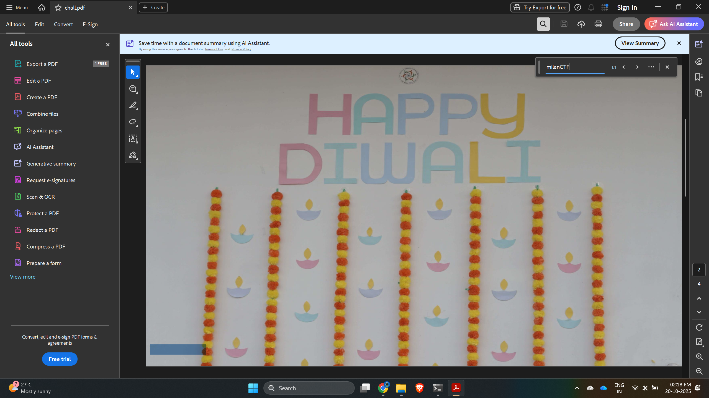

This shows the highlighted invisible text text written, which is the flag.


# Crypto
# CrYpTo
**Description:** Find the flag

### Attachments: py.py, encrypted.txt

### Flag : `milanCTF25{H4st4ds_Br0adca5t_4tt4ck}`

### Solution :

Opening `encrypted.txt` shows many RSA ciphers (N, E and CT)

We can see that e=3, from which we can try Chinese Remainder Theorem.

Using the python code below can can get the flag.

```python
# Parsing the provided challenge data (paste into a triple-quoted string)
data = r"""
n: 20031234749824324460456903480532839974582513632080902434427760048252727241470581195134992144403541301948670120469648180471531815392610622175975671183739518519264041192708880483765483197980506804300773980831148380461513366797868482255878092226062825956558546903524396730548121234659411464847837148307945658737049799161384188624625615991759512092391160585359910349035877184123051875622466864109152148711172419005299322035651603958407254051330349878846855530509574908723516343358006955979944037380509043784198195204579667419943003998224301961127031359198111861902545516293288688044561480419426147370496093879842387833837
e: 3
ciphertext: 27563928898525699794420952333250310652818590552214379340615914418217938277674423312901829550191087036914061567985450541333124927787324627341180396767080048425459877165522819688321282449052488000

n: 21206951829423536985999684380229965486920237643279404113779150904331461448572792875990960359751471930509004189691975820392808345391350427427766563473639332539287595293010257545064614719846490617299758374468534504973944787337963073700555097969888684145333047325818518061972127555090390892790055653873845859006674153773383711456414780572816850255678551547526291796534961795266194982796227140509681654611767500173645300447285889681766972458777397557988419172155566190886369822640151926655866963268835279195408275983650921756468294186511472403332860129036011606184336059438125753130985279463632947387145812781350454150123
e: 3
ciphertext: 100572986272833617433556557320167286135050873505758904519016214979594566974366790771703176662153832852660045632184311129889022989769356673057735299637622898921692802711794919848779968888594306151157243863179356438057

n: 16749394795342004374134570596361253476561613753421374120098820361360654580939706721626526414463791082320503911660250679804785660354820737155065588050674345174245339383822793419686665081054306979987402500638699197165273923315811911011098288833230265006345230245664453148570221806361610799616387908055051840794686806206359419918453574410631255467504683726010263552693569209527539436388583298765876200722668911856859057446512552047019259798516612277258766501943744684311065636365238922522386175977803498901055547108704081741621431537262758365175315969563302054890900141863275782228638288189904699764314619850669288309109
e: 3
ciphertext: 2501325350826784555840412357956618973355317828239358498430189505719648621816288857437512023944694251993912563336234015105978985739268083262912916657131055044216429585161624493149732163904

n: 13385414188082787960404941436913699529532683077047896391877879193302934325422583410272691449476143195866834005049881765391710226895013608830453448775223949739221010734609370902636002471418357848425076196656189092979260676449076995710243407430471236617140567901853244797683372126748830740102640162532637314720572321513472178321532684807570012913292326345405164739538123842137362955936893935352378048914184479943545219142934482742745105184467367615165090254394052617117669898756404570439841947739014427031856123090151834566763922234198767948823658263979585969519071165666740854607043143863890376453748488405875985341379
e: 3
ciphertext: 165168464783965952528776804519178311997715216362861141787812189327932482289621340262695391251657553163373777549545607262227476414646367289732209050181535071398005498508624380980125

n: 13284548022050884454677049324180078996360076712947488047167198134069944213125705115685621608174859738589721931475459675886147117020955865721887051122760901238672901677373178240010565115836543004597555362437766152285433475967370446160180257058520685301018321019313131432036486526040049632536586525958663957050609006946874139337232517796870613036145759503913544403791315255416548877487711133369587468571112336354727697793122662657520471665687228479267858890063587642513262483634441785471130856975471187243183414990064442612003003866555919164771385045081917904848261003337971706062769659557220289790015632359473269341851
e: 3
ciphertext: 9602602811829615730746554002270190187349858592097358942671784861246570387712480017608341427411720526682750300572453983414530234059415347037114329987352506695564306932652979474036928675534474225442926445352764207221867730556662375976089403471890845907132225125

n: 10322320633943151591053076812749197918784455082544600610423571253776468354357504663537041524455923840117905679061646385743223317228376111656802307880447952464839238754934102915999891228266656082185789185828026274584229006134246863537095750704876291500484955411326556641090514110306479104463486587688173527918635989696750099652088184650938421120642450507938991638295845911199660197728237038824468302487007445129336739599637020968783899733929777046163637273205329841597026244612001679149523925637838916920774047444992258951323960783114799271850915029722385311579895125238459295369418782954812410126356771689650746542821
e: 3
ciphertext: 165168464783965952528776804519178311997715216362861141787812189327932482289621340262695391251657553163373777549545607262227476414646367289732209050181535071398005498508624380980125

n: 19753279576234704664458919406349056467498888724718722137897393323106498627266612337621625730605518798916387603030372029551108849386130106468310762072598385770288541629299469288009824857064436848203769583982031100526274165555323591699427162963839835579694495521842605126094239417140038262075469125081088575721194683732924972693237961996588222752499586914172163821183063042181839097895455127157996613366724432941849006234754175116789145805833747001853431217075530938930610642803299827758182662819906878876239140904474100067339311858686048239309544163629350379489567283060453432570761871481314403927289191340870095117429
e: 3
ciphertext: 9602602811829615730746554002270190187349858592097358942671784861246570387712480017608341427411720526682750300572453983414530234059415347037114329987352506695564306932652979474036928675534474225442926445352764207221867730556662375976089403471890845907132225125

n: 14800738750776454935931990405758259302703908348822905999551509950465598675617074918918890515126837747779495755074391895609797639089243440583605779633977053681694198645020126385837364495899711372157407127677630998239185739686306897532999505137578013472296376124636704161416444551888922789868865016493480007097795593930419052491498184282282243043930318341180298393021288890809615885779170458545830909158732672314411762157967444754630594347588519067575609081456875394186663871501778036353766219356932263272032884661563379357613094906817544113943507117011861561826056072546178203356099306673121996550280139852292855315679
e: 3
ciphertext: 2501325350826784555840412357956618973355317828239358498430189505719648621816288857437512023944694251993912563336234015105978985739268083262912916657131055044216429585161624493149732163904

n: 14905802797437647657248150200681466615984280085198713631431419681388649315580325593070044576052584212394628606300755562028127944261932029408543164373342618932415218837682051022770090260972621218146279990611346082664231740731286305621721819816420389825863036595602532602485682490208862690225276701103859508230899074646037901901625575099714490302012253017843705311849718351867176609715168985367396405996380504509220163667623069844095830180586449931667494863395540619996181604754863495446837994011523778576591447200447272952137856760581750849162563480592292043405420899732127285976541256753224537578354913792041983360321
e: 3
ciphertext: 9602602811829615730746554002270190187349858592097358942671784861246570387712480017608341427411720526682750300572453983414530234059415347037114329987352506695564306932652979474036928675534474225442926445352764207221867730556662375976089403471890845907132225125

n: 20322196267906472702724506737333347521741816738587289100063534366469487686127089648153501115431145575355579212934192691372829630067654005092315313341421875477902346945690860763191540966098295457875763184058990531319568032646551075040173114939759729891281155117271732907854371994970604772555706480697157030311482473746953915734307573944748198780163786950140052455170318328610230725752440942783252971807118626618045304756080695601101613659366534413348102854365100970262533626163799668090446980020955989626755161032679444258875026189914443109643567244125462820038672219344860430118171140640676760040207689148257501328101
e: 3
ciphertext: 100572986272833617433556557320167286135050873505758904519016214979594566974366790771703176662153832852660045632184311129889022989769356673057735299637622898921692802711794919848779968888594306151157243863179356438057

n: 19224749468461374895264138828943268678349740902954404810086844974751771266471567817414826507170089184286870550379352468525541031848027255865285269065126635215488700662216650215053021263797653433071213173683607247069566520605180761441883257887341859071715866905818985242623007458021445613945655240681428776166234017519696156522285456721359696325704642290511792918986606037491090949277179783241535388240989963362011175846516197178593345910175098157358399373313057033002490605542740780505446029254387865905335315804795497992036493565061102655372169619443636069449312393341928612704893083566208012994156151151969063495799
e: 3
ciphertext: 165168464783965952528776804519178311997715216362861141787812189327932482289621340262695391251657553163373777549545607262227476414646367289732209050181535071398005498508624380980125

n: 11170862774785996454245397573497465743461145044668642611109305176542981594980272642616808764589056389210204192706302605330013258523267513733828300599721795758131944867393164573372241088956950489420708477909583726421328102242727575205441518520315435686363358952944424579933636336184982672610699809182749862237694232295851378632955959597742326225412033044787649213608317828687098239233705723173785782543400174037596128595768502139524870105684226474835833366252323896069344584589832343658620595659269087321622654435437631899656840685452860061687364521930673819907506291122304505176547243593892883866641532199737019102943
e: 3
ciphertext: 27563928898525699794420952333250310652818590552214379340615914418217938277674423312901829550191087036914061567985450541333124927787324627341180396767080048425459877165522819688321282449052488000

n: 18143448210021705475794384265128655102335187983106487589658831285714331609910565588282511407405557938238186929709864375442279395515201884162168904938528532807990933218334343882520743970224288744808613971935332651595206704788128440958459740285768391318478720670774788539748744146591739244410196988456038735063014733598193848260310095427616390059613715629566096826605678882977599048431987694985458603859453776528276212856954787941951941382210387196360761845766879023652008191237808627947904104651733329843352430643574349281992995870231899815982098722087007500612412434004780014131015641770313234889870019408365966211121
e: 3
ciphertext: 100572986272833617433556557320167286135050873505758904519016214979594566974366790771703176662153832852660045632184311129889022989769356673057735299637622898921692802711794919848779968888594306151157243863179356438057

n: 27206166676886647269546981159947137377910144460188133850780757816722760360408623132742215175281144249411884138570010359480433365277722208278008754962613438895816036122428134610065825089764042370392854064574267866810851424959276982390176412571591622027011445310439113382252249330583301304911297887140097429405610746802041069825633083268771576103196106196105259979582510740772049210202991628400286631334346555260375249431784393283286431160479379905907741833101557371304925622035295018440112158352011631824883959411681005439236003619720684158726970060290192493734056098423683587562658641311138054804440800759755711979453
e: 3
ciphertext: 27563928898525699794420952333250310652818590552214379340615914418217938277674423312901829550191087036914061567985450541333124927787324627341180396767080048425459877165522819688321282449052488000

n: 13518851046977522582729109518945313823786157461478123920909402301996852694601283275828614323453449444456160857095035292745073370800605895162525292617732628814131054694040869529556741823704841507111996910595497798959313847267299828765871286097764997655844284995067820348934471943361697089309686625379861865405296289286560707785328690792046872064533889592364041072587055210728561817336473157670663393891788322698955652544830399435779995418265008580318123466447544477507848657736657901725637670117775882764349325462383506770718079021324050673841318178182347174379705035337215810557477949407823126871438542447457191487841
e: 3
ciphertext: 2501325350826784555840412357956618973355317828239358498430189505719648621816288857437512023944694251993912563336234015105978985739268083262912916657131055044216429585161624493149732163904
"""

# Parse entries
entries = []
lines = [l.strip() for l in data.strip().splitlines() if l.strip()]
i = 0
while i < len(lines):
    if lines[i].startswith('n:'):
        n = int(lines[i].split(':',1)[1].strip())
        e = int(lines[i+1].split(':',1)[1].strip())
        c = int(lines[i+2].split(':',1)[1].strip())
        entries.append((n,e,c))
        i += 3
    else:
        i += 1

# Group by ciphertext value
from collections import defaultdict
groups = defaultdict(list)
for n,e,c in entries:
    groups[c].append(n)

# Show groups with count >= 3 (candidate for Hastad)
candidates = {c: ns for c,ns in groups.items() if len(ns) >= 3}
len(candidates), list(candidates.keys())[:6]


# Function for integer cube root
def iroot3(x):
    lo = 0
    hi = 1 << ((x.bit_length() // 3) + 2)
    while lo < hi:
        mid = (lo + hi) // 2
        t = mid*mid*mid
        if t == x:
            return mid, True
        if t < x:
            lo = mid + 1
        else:
            hi = mid
    # lo is first with cube > x
    return lo-1, (lo-1)**3 == x

recovered = {}
for c, ns in candidates.items():
    m, exact = iroot3(c)
    recovered[c] = (m, exact)
    try:
        text = m.to_bytes((m.bit_length()+7)//8, 'big').decode()
    except Exception as e:
        text = None
    print("ciphertext (len ns):", len(ns))
    print("c:", c)
    print("cube root exact:", exact)
    print("m:", m)
    print("decoded:", text)
    print("-"*60)

```

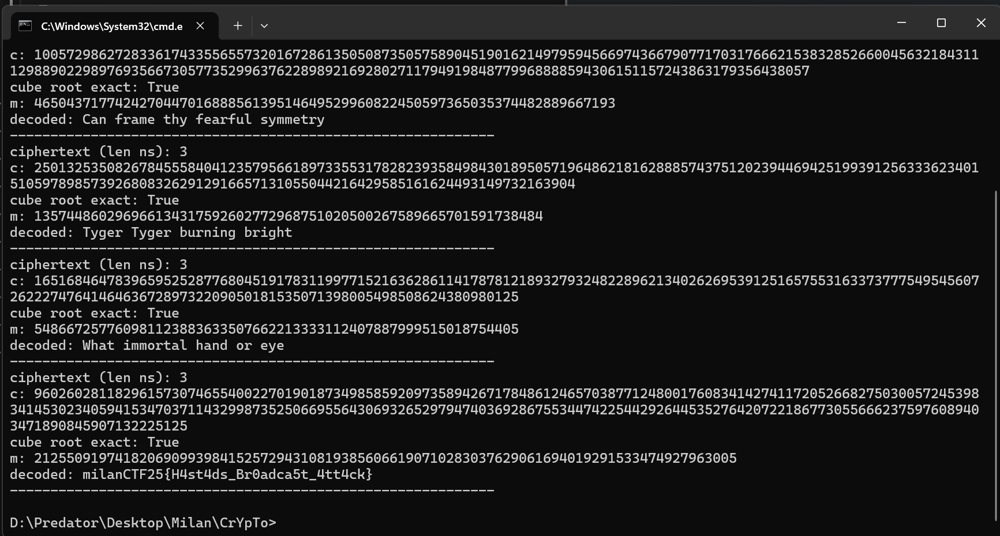


# OSINT
# FindMe

**Description:** Find the location where the image was token, flag should be in the format milanCTF{(city name)_(county name)} For example, if the image was taken in Brooklyn (which is in Kings County), flag will be milanCTF25{Brooklyn_Kings_County}

### Attachments: chall.png

### Flag : `milanCTF25{Kyrksæterøra_Trøndelag}`

### Solution : 

On opening chall.png, we can see that its taken from google maps, it has street name (`Prinsengata`) and shop name (`Fixit`)

We can use Google Lens and extract the text from the image.

Now we know the street name `Prinsengata`. Searching this on google maps Gives a long street, Now zooming into the location and searching for `Fixit` (The Shop Name). We get the exact coordinates.

**Location :** https://maps.app.goo.gl/m7TEGZDTeiJLPo9n7?g_st=ac

The City name and Country name are : `Kyrksæterøra Trøndelag`

Using the format `milanCTF25{Brooklyn_Kings_County}` gives us `milanCTF25{Kyrksæterøra_Trøndelag}`

# Binary Exploitation
# Unsanitary

**Description :** Can you find the problem with this password checker?

`nc milan.kludge.co.in 10003`

### Attachments: chall

### Flag : `milanctf25{f0rm4t_str1ng_d4ta_l3ak_172832}`

### Solution : 

Uploading the given file to DogBolt and seeing angr gives us:

```C
extern struct_0 *g_804bfec;

int _init()
{
    if (!g_804bfec)
        return g_804bfec;
    return g_804bfec();
}

extern unsigned int g_804bff8;
extern unsigned int g_804bffc;

void sub_8049020()
{
    unsigned int v0;  // [bp-0x4]

    v0 = g_804bff8;
    goto g_804bffc;
}

int _start()
{
    unsigned int v0;  // [bp-0x8]
    unsigned int v1;  // [bp+0x0]
    unsigned int v2;  // [bp+0x0]
    unsigned int v3;  // [bp+0x4]
    unsigned int v4;  // eax
    unsigned int v5;  // edx

    v1 = v4;
    v0 = v5;
    __libc_start_main(main_1, v2, &v3, 0, 0); /* do not return */
}

void sub_80490f8()
{
    [D] Unsupported jumpkind Ijk_SigTRAP at address 134516984()
}

void sub_80490f9(unsigned int a0, unsigned int a1, unsigned int a2)
{
    return;
}

void main_1()
{
    main();
    return;
}

void _dl_relocate_static_pie()
{
    return;
}

void __x86.get_pc_thunk.bx()
{
    return;
}


void sub_8049130()
{
    return;
}


int sub_8049161()
{
    return 0;
}

extern char __TMC_END__;

void sub_80491b0()
{
    if (!__TMC_END__)
    {
        sub_8049130();
        __TMC_END__ = 1;
    }
    return;
}

void sub_80491e0()
{
}

typedef struct FILE_t {
    unsigned int _flags;
    char * _IO_read_ptr;
    char * _IO_read_end;
    char * _IO_read_base;
    char * _IO_write_base;
    char * _IO_write_ptr;
    char * _IO_write_end;
    char * _IO_buf_base;
    char * _IO_buf_end;
    char * _IO_save_base;
    char * _IO_backup_base;
    char * _IO_save_end;
    struct _IO_marker *_markers;
    struct _IO_FILE * _chain;
    unsigned int _fileno;
    unsigned int _flags2;
    unsigned int _old_offset;
    unsigned short _cur_column;
    char _vtable_offset;
    char _shortbuf[1];
    struct pthread_mutex_t *_lock;
    char padding_4c[4];
    unsigned long long _offset;
    struct _IO_codecvt * _codecvt;
    struct _IO_wide_data * _wide_data;
    struct _IO_FILE * _freeres_list;
    char __pad5;
    char padding_65[3];
    unsigned int _mode;
    char _unused2[20];
} FILE_t;

typedef struct _IO_marker {
    struct _IO_marker * _next;
    FILE * _sbuf;
    unsigned int _pos;
} _IO_marker;

typedef struct _IO_FILE {
} _IO_FILE;

typedef struct pthread_mutex_t {
} pthread_mutex_t;

typedef struct _IO_codecvt {
    _IO_iconv_t __cd_out;
} _IO_codecvt;

typedef struct _IO_wide_data {
    wchar_t * _IO_read_ptr;
    wchar_t * _IO_read_end;
    wchar_t * _IO_read_base;
    wchar_t * _IO_write_base;
    wchar_t * _IO_write_ptr;
    wchar_t * _IO_write_end;
    wchar_t * _IO_buf_base;
    wchar_t * _IO_buf_end;
    wchar_t * _IO_save_base;
    wchar_t * _IO_backup_base;
    wchar_t * _IO_save_end;
    __mbstate_t _IO_state;
    char padding_31[3];
    __mbstate_t _IO_last_state;
    char padding_39[3];
    unsigned short _shortbuf[1];
    _IO_jump_t _wide_vtable;
} _IO_wide_data;

typedef struct FILE {
} FILE;

typedef struct _IO_iconv_t {
} _IO_iconv_t;

typedef struct __mbstate_t {
    unsigned int __count;
    char __value;
} __mbstate_t;

typedef struct _IO_jump_t {
} _IO_jump_t;

void main()
{
    char v0[48];  // [bp-0x64]
    char v1[16];  // [bp-0x34]
    uint128_t v2;  // [bp-0x24]
    FILE_t *v3;  // [bp-0x14]
    char *v4;  // [bp-0x10]
    unsigned int v5;  // [bp-0x4]
    unsigned int v6;  // [bp+0x0]
    unsigned int v7;  // [bp+0x4]

    v5 = v6;
    v4 = &v7;
    v2 = 0;
    *((uint128_t *)&v1) = 0;
    v3 = fopen("passwd.txt", "r");
    fgets(&v2, 16, v3);
    fclose(v3);
    v1[strlen(&v2)] = 0;
    printf("Enter the password: ");
    __isoc23_scanf("%15s", &v1);
    if (strcmp(&v1, &v2))
    {
        puts("permission denied using password : ");
        printf(&v1);
        putchar(10);
        return;
    }
    puts("good job");
    v3 = fopen("flag.txt", "r");
    fgets(&v0, 48, v3);
    fclose(v3);
    puts(&v0);
    return;
}

void _fini()
{
    return;
}
```

First Trying with `%p.%p.%p.%p.%p.%p.%p.%p.%p.%p`

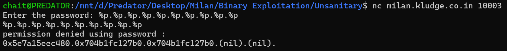

Now we try this `%6$p%7$p%8$p` i.e. accessing 6th, 7th, and 8th stack parameters directly

The 8th Position gives `0x6e31727453746d46` which decodes to `n1rtStmF` which in little-endian is `FmtStr1n`

Extracting the 9th stack parameter gives us `0x6e31727453746d46.0x6b61334c67` which says in little-endian is `FmtStr1ngL3ak`

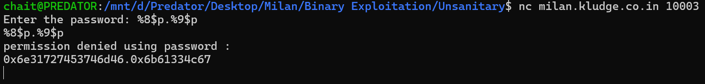

The password is `FmtStr1ngL3ak`

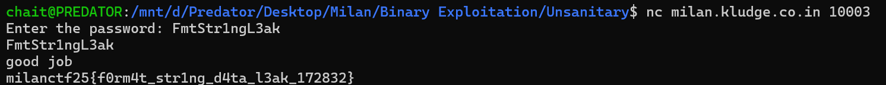

# Forensics
# Spectral Whisper
**Description:** Centuries ago, Gauss sought patterns hidden deep in celestial paths. Now, it's your turn to unravel secrets lurking beneath channels unseen.

### Attachments: chall.jpg

### Flag : `milanctf25{ls8_1snt_th3_0nly_w4y_9187361}`

### Solution : 

Clearly the image is a FFT encoded image. (from ECE and image processing).

Googling `fft image decoder ctf` gives us https://www.geeksforgeeks.org/computer-vision/fast-fourier-transform-in-image-processing/

Now we write a python code for our needs

```python
import numpy as np
from PIL import Image, ImageEnhance

def method1_perchannel_fft(img_array):
    """Method 1: Per-Channel RGB FFT (processes R, G, B separately)"""
    print("\n[Method 1] Per-Channel RGB FFT")
    print("-" * 70)
    
    processed_channels = []
    
    for i in range(img_array.shape[2]):
        channel = img_array[:, :, i]
        
        # Perform 2D FFT on this channel
        f_transform = np.fft.fft2(channel)
        f_shift = np.fft.fftshift(f_transform)
        
        # Calculate magnitude spectrum
        magnitude_spectrum = np.abs(f_shift)
        
        # Apply log scale using np.log1p (log(1+x))
        log_spectrum = np.log1p(magnitude_spectrum)
        
        # Normalize to 0-255
        log_spectrum_normalized = 255 * (log_spectrum - np.min(log_spectrum)) / (np.max(log_spectrum) - np.min(log_spectrum))
        
        processed_channels.append(log_spectrum_normalized.astype(np.uint8))
        
        # Save individual channel
        channel_names = ['red', 'green', 'blue']
        Image.fromarray(log_spectrum_normalized.astype(np.uint8)).save(f'method1_channel_{channel_names[i]}.png')
        print(f"  Saved: method1_channel_{channel_names[i]}.png")
    
    # Combine channels back into RGB
    result_img_array = np.stack(processed_channels, axis=-1)
    Image.fromarray(result_img_array).save('method1_rgb_combined.png')
    print(f"  Saved: method1_rgb_combined.png (COMBINED RGB)")
    
    return result_img_array

def method2_20log(img_array):
    """Method 2: Grayscale with 20*log formula"""
    print("\n[Method 2] Grayscale with 20*log formula")
    print("-" * 70)
    
    img_gray = np.mean(img_array, axis=2)
    f = np.fft.fft2(img_gray)
    fshift = np.fft.fftshift(f)
    
    magnitude_spectrum = 20 * np.log(np.abs(fshift) + 1)
    
    mag_norm = ((magnitude_spectrum - magnitude_spectrum.min()) / 
                (magnitude_spectrum.max() - magnitude_spectrum.min()) * 255).astype(np.uint8)
    
    Image.fromarray(mag_norm).save('method2_20log.png')
    Image.fromarray(255 - mag_norm).save('method2_20log_inverted.png')
    print(f"  Saved: method2_20log.png and method2_20log_inverted.png")
    
    return fshift, 255 - mag_norm

def method3_log1p(fshift):
    """Method 3: Grayscale with log1p formula"""
    print("\n[Method 3] Grayscale with log1p formula")
    print("-" * 70)
    
    magnitude_spectrum = np.log1p(np.abs(fshift))
    
    mag_norm = ((magnitude_spectrum - magnitude_spectrum.min()) / 
                (magnitude_spectrum.max() - magnitude_spectrum.min()) * 255).astype(np.uint8)
    
    Image.fromarray(mag_norm).save('method3_log1p.png')
    Image.fromarray(255 - mag_norm).save('method3_log1p_inverted.png')
    print(f"  Saved: method3_log1p.png and method3_log1p_inverted.png")
    
    return 255 - mag_norm

def method4_regular_log(fshift):
    """Method 4: Regular log formula"""
    print("\n[Method 4] Grayscale with regular log formula")
    print("-" * 70)
    
    magnitude_spectrum = np.log(np.abs(fshift) + 1)
    
    mag_norm = ((magnitude_spectrum - magnitude_spectrum.min()) / 
                (magnitude_spectrum.max() - magnitude_spectrum.min()) * 255).astype(np.uint8)
    
    Image.fromarray(mag_norm).save('method4_log.png')
    Image.fromarray(255 - mag_norm).save('method4_log_inverted.png')
    print(f"  Saved: method4_log.png and method4_log_inverted.png")
    
    return 255 - mag_norm

def enhance_and_extract_quadrants(mag_inverted, method_name):
    """Enhance contrast and extract quadrants to avoid text overlap"""
    print(f"\n[{method_name}] Extracting quadrants and enhancements")
    print("-" * 70)
    
    # High contrast enhancement
    img_pil = Image.fromarray(mag_inverted)
    enhancer = ImageEnhance.Contrast(img_pil)
    mag_enhanced = enhancer.enhance(5.0)
    mag_enhanced.save(f'{method_name}_enhanced.png')
    
    # Binary threshold
    mag_array = np.array(mag_enhanced)
    threshold = np.percentile(mag_array, 70)
    mag_binary = np.where(mag_array > threshold, 255, 0).astype(np.uint8)
    Image.fromarray(mag_binary).save(f'{method_name}_binary.png')
    
    # Extract quadrants
    h, w = mag_inverted.shape
    cy, cx = h // 2, w // 2
    
    q_tl = mag_inverted[0:cy, 0:cx]
    q_tr = mag_inverted[0:cy, cx:w]
    q_bl = mag_inverted[cy:h, 0:cx]
    q_br = mag_inverted[cy:h, cx:w]
    
    # Save flipped quadrants for readability
    Image.fromarray(np.fliplr(q_tl)).save(f'{method_name}_quad_tl_fixed.png')
    Image.fromarray(np.flipud(np.fliplr(q_tr))).save(f'{method_name}_quad_tr_fixed.png')
    Image.fromarray(np.fliplr(np.flipud(q_bl))).save(f'{method_name}_quad_bl_fixed.png')
    Image.fromarray(np.flipud(q_br)).save(f'{method_name}_quad_br_fixed.png')
    
    print(f"  Saved: {method_name}_enhanced.png (high contrast)")
    print(f"  Saved: {method_name}_binary.png (thresholded)")
    print(f"  Saved: {method_name}_quad_*_fixed.png (4 corrected quadrants)")

def main():
    """Main function to run all FFT analysis methods"""
    print("="*70)
    print("SPECTRAL WHISPER - COMPREHENSIVE FFT ANALYSIS")
    print("="*70)
    
    # Load image
    try:
        img = Image.open('chall.jpg')
        img_array = np.array(img)
        print(f"\nImage loaded successfully. Shape: {img_array.shape}\n")
    except FileNotFoundError:
        print("Error: 'chall.jpg' not found!")
        return
    
    # Run all methods
    method1_perchannel_fft(img_array)
    
    fshift, mag_inv_2 = method2_20log(img_array)
    
    mag_inv_3 = method3_log1p(fshift)
    
    mag_inv_4 = method4_regular_log(fshift)
    
    # Enhance and extract quadrants for each method
    enhance_and_extract_quadrants(mag_inv_2, 'method2')
    enhance_and_extract_quadrants(mag_inv_3, 'method3')
    enhance_and_extract_quadrants(mag_inv_4, 'method4')
    
    print("\n" + "="*70)
    print("ANALYSIS COMPLETE!")
    print("="*70)
    print("\nGenerated files:")
    print("  1. method1_rgb_combined.png - Per-channel RGB FFT (check this first!)")
    print("  2. method2_20log_inverted.png - 20*log formula")
    print("  3. method3_log1p_inverted.png - log1p formula")
    print("  4. method4_log_inverted.png - Regular log formula")
    print("\nEnhanced versions:")
    print("  - *_enhanced.png - High contrast versions")
    print("  - *_binary.png - Binary thresholded versions")
    print("  - *_quad_*_fixed.png - Corrected quadrants (no overlap)")
    print("\nCheck these files for the hidden flag!")

if __name__ == "__main__":
    main()
```

Running this code gives us Overlapped Flag as an image.

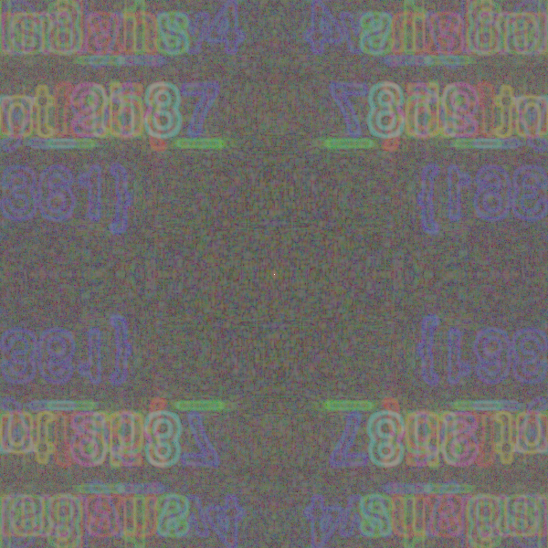

From this we can use `stegsolve` to extract individual R G B and get the complete flag.

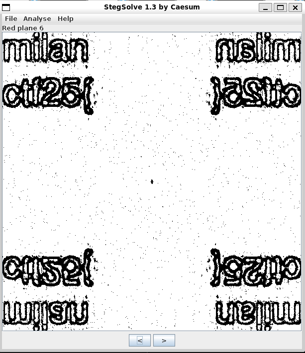

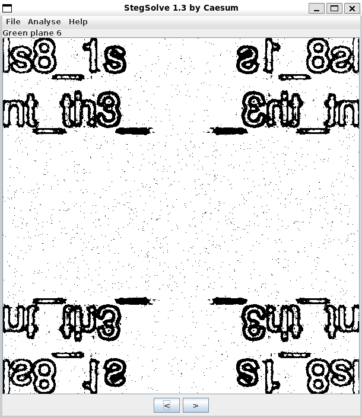

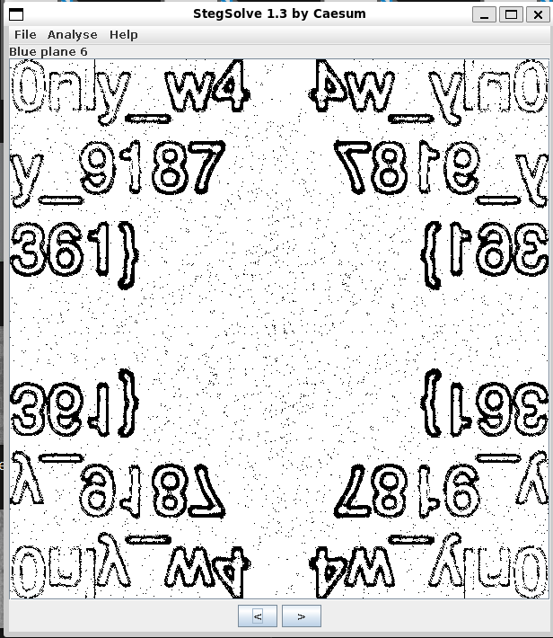

Combining all gives us the flag `milanctf25{ls8_1snt_th3_0nly_w4y_9187361}`

# Forensics
# Starry Night

**Description :** Look, I took this cool photo of the sky!

### Attachments: pillars2.jpg

### Flag : ``milanctf25{h1dd3n_1n_th3_st4rs_3948384}``

### Solution : 

Running `foremost` on it gives us an image and an PDF

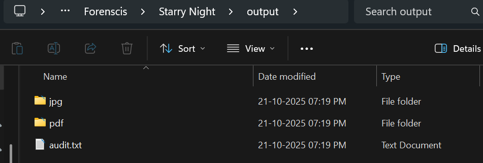

The PDF says `X,Y` (No Space)


So we know there is password of some kind that needs coords X,Y.

Running `Exiftool` on the images gives us X, Y cords.

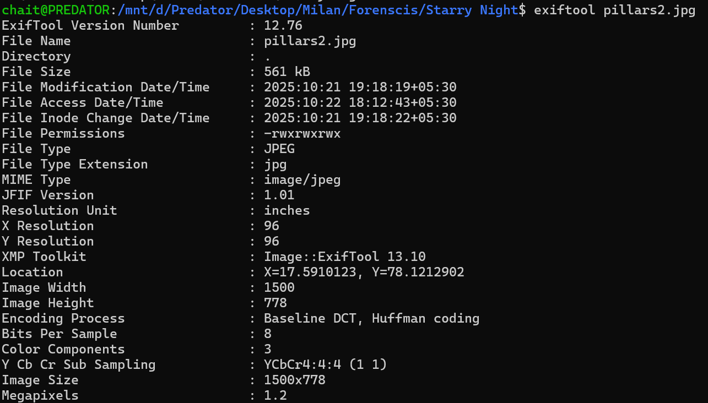

X=17.5910123, Y=78.1212902

Password : 17.5910123,78.1212902

Useing `steghide extract -sf pillars2.jpg`. When asked for password. Enter the X and Y cords.

This gives us res.txt

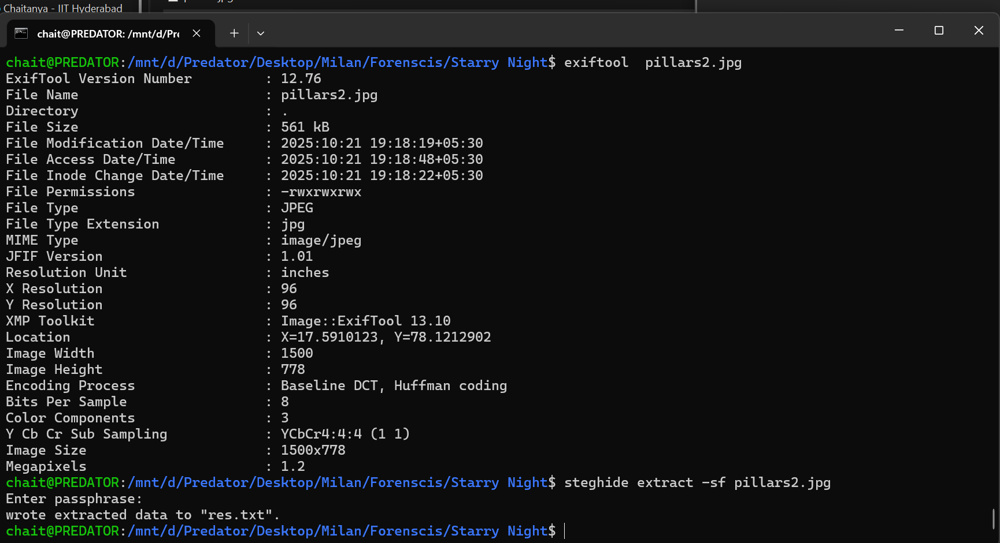


Scrolling Down in `res.txt` we get a QR code.

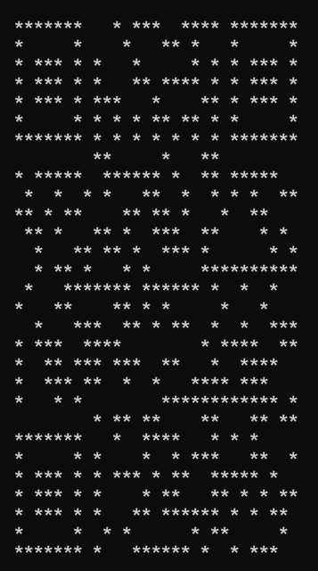

Enhance QR using Python

```python
from PIL import Image
import numpy as np

def extract_qr_code(input_file='res.txt', output_file='qr_code_final.png', scale=10):
    """
    Extract QR code from ASCII art and save as image
    
    Args:
        input_file: Path to the ASCII art file
        output_file: Path to save the QR code image
        scale: Scaling factor for the output image (default: 10)
    """
    # Read the file
    with open(input_file, 'r') as f:
        lines = f.readlines()
    
    # Find the QR code section (look for the characteristic ******* pattern)
    qr_start = -1
    for i, line in enumerate(lines):
        if '*******' in line and qr_start == -1:
            qr_start = i
            break
    
    if qr_start == -1:
        print("Could not find QR code in file")
        return False
    
    # Extract approximately 29 lines (standard QR code size)
    qr_lines = lines[qr_start:qr_start + 29]
    
    # Find max width
    max_width = max(len(line.rstrip()) for line in qr_lines)
    
    print(f"Found QR code at line {qr_start}")
    print(f"QR code dimensions: {len(qr_lines)} lines x {max_width} characters")
    
    # Create binary image array
    height = len(qr_lines)
    width = max_width
    
    # White background (255), black for asterisks (0)
    img_array = np.ones((height, width), dtype=np.uint8) * 255
    
    for y, line in enumerate(qr_lines):
        line_stripped = line.rstrip('\n\r')
        for x in range(len(line_stripped)):
            if line_stripped[x] == '*':
                img_array[y, x] = 0  # Black pixel
    
    # Create PIL Image
    img = Image.fromarray(img_array, mode='L')
    
    # Scale up for better scanning
    large_img = img.resize((width * scale, height * scale), Image.NEAREST)
    large_img.save(output_file)
    
    print(f"\n✓ QR code saved as: {output_file}")
    print(f"  Image size: {width * scale}x{height * scale} pixels")
    print(f"\nScan this image with:")
    print("  - Your phone's camera or QR scanner app")
    print("  - zbarimg command: zbarimg", output_file)
    print("  - Online decoder: https://zxing.org/w/decode")
    
    return True

if __name__ == "__main__":
    import sys
    
    # Check if input file is provided
    input_file = sys.argv[1] if len(sys.argv) > 1 else 'res.txt'
    output_file = sys.argv[2] if len(sys.argv) > 2 else 'qr_code_final.png'
    
    print("QR Code Extractor")
    print("=" * 50)
    
    try:
        extract_qr_code(input_file, output_file)
    except FileNotFoundError:
        print(f"Error: Could not find file '{input_file}'")
    except Exception as e:
        print(f"Error: {e}")
```


Scan QR for flag : `milanctf25{h1dd3n_1n_th3_st4rs_3948384}`


# Forensics
# Can You Read It?

**Description :** Entangled Thoughts

In a quiet room where shadows play, A voice unfolds what words can’t say, Of freedom lost and dreams that soar, Of walls that vanish, and so much more.

It whispers tales of Shawshank’s halls, Where hope survives the prison walls. A rock, a letter, a hidden key, Freedom is both what we see and believe.

Beyond our world, a curious guide, Explores the stars where secrets hide. Through The Wormholes vast and twisting streams, Season two unravels quantum dreams.

Anton works where photons gleam, Entwined in ways that bend our dream. Across the void, a secret dance, Two distant sparks share one glance.

Shawshank taught us hope is rare, Entanglement shows bonds are everywhere. The rock, the stars, the quiet night, All connected by an unseen light.

Follow these threads if you dare, Through whispered halls and cosmic air. And know this truth, though subtle in name: The password that brought Anton his fame:

### Attachments: chall.zip

### Flag : `milanctf25{wh47_4_w3ird_f0n7_9812}`

### Solution : 

There is a Encrypted Zip file.

Running `strings` on the zip says we have `.txt`, `.ttf` which are not encrypted and the `.png` is encrypted.

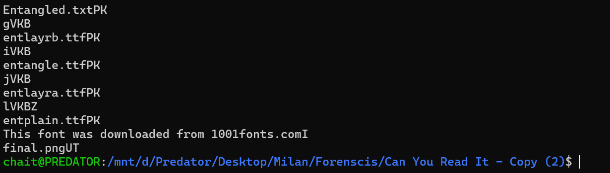

Extracting those files using Python

```Python
import sys
import struct
import zipfile
from pathlib import Path

def find_all(data, pattern):
    i = 0
    while True:
        i = data.find(pattern, i)
        if i == -1:
            break
        yield i
        i += 1

def get_eocd_end(data, start):
    # find EOCD signature after start
    eocd_sig = b'PK\x05\x06'
    eocd_i = data.find(eocd_sig, start)
    if eocd_i == -1:
        return None
    # comment length stored as little-endian uint16 at offset + 20
    if eocd_i + 22 <= len(data):
        comment_len = struct.unpack_from('<H', data, eocd_i + 20)[0]
        end = eocd_i + 22 + comment_len
        return end
    return None

def main(filename):
    p = Path(filename)
    data = p.read_bytes()
    starts = list(find_all(data, b'PK\x03\x04'))
    print(f"Found {len(starts)} PK local-file headers.")
    out_dir = Path('carved_zips')
    out_dir.mkdir(exist_ok=True)
    for idx, s in enumerate(starts, 1):
        print(f"-> trying start at offset {s}")
        end = get_eocd_end(data, s)
        if end is None:
            print("   no EOCD found after this start; using file-end (may fail).")
            end = len(data)
        slice_bytes = data[s:end]
        zip_path = out_dir / f"found_zip_{idx}.zip"
        zip_path.write_bytes(slice_bytes)
        try:
            z = zipfile.ZipFile(zip_path)
            # test listing
            print("   zip contents:", z.namelist())
            extract_dir = out_dir / f"out_{idx}"
            extract_dir.mkdir(exist_ok=True)
            z.extractall(path=extract_dir)
            print(f"   extracted to {extract_dir}")
        except Exception as ex:
            print("   not a valid zip or corrupted:", ex)

if __name__ == '__main__':
    if len(sys.argv) != 2:
        print("Usage: carve_zips_and_extract.py <file>")
        sys.exit(1)
    main(sys.argv[1])
```

We see one font is weird `entlayrb.ttf`

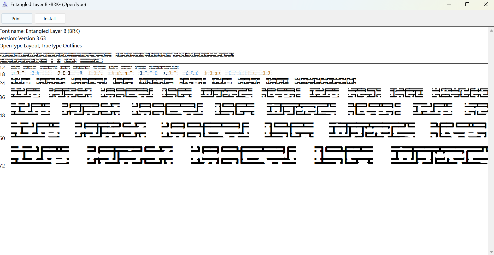


Next, we install all fonts. Its as easy as clicking on Install Button on Windows.


The following code is written to generate an image of all characters of that font.

```Python
#!/usr/bin/env python3
# inspect_fonts.py  -- fixed to avoid ImageDraw.textsize error

from fontTools.ttLib import TTFont
from PIL import Image, ImageDraw, ImageFont
import os, glob
from pathlib import Path

PRINTABLE = [chr(i) for i in range(32, 127)]  # printable ASCII
PRINTABLE += ['\u00AB', '\u00BB']  # « »

OUTDIR = "font_inspect_out"
os.makedirs(OUTDIR, exist_ok=True)

def dump_cmap(ttf_path):
    font = TTFont(ttf_path)
    print("\n---", os.path.basename(ttf_path), "---")
    cmap = {}
    for table in font['cmap'].tables:
        cmap.update(table.cmap)
    for ch in PRINTABLE:
        code = ord(ch)
        if code in cmap:
            glyph = cmap[code]
            print(f"U+{code:04X} {repr(ch):6} -> {glyph}")
        else:
            print(f"U+{code:04X} {repr(ch):6} -> (no mapping)")
    glyphs = font.getGlyphOrder()
    print(f"Glyph count: {len(glyphs)}  First 30 glyph names: {glyphs[:30]}")
    font.close()

def render_font(ttf_path):
    fontname = Path(ttf_path).stem
    out_png = os.path.join(OUTDIR, f"fonts_{fontname}_glyphs.png")

    cell_w, cell_h = 100, 140
    cols = 12
    items = PRINTABLE
    rows = (len(items) + cols - 1) // cols
    img_w = cols * cell_w
    img_h = rows * cell_h

    img = Image.new("RGB", (img_w, img_h), "white")
    draw = ImageDraw.Draw(img)

    try:
        pilfont = ImageFont.truetype(ttf_path, 72)
    except Exception as e:
        print("Cannot load font with PIL:", e)
        return

    for idx, ch in enumerate(items):
        col = idx % cols
        row = idx // cols
        x = col * cell_w
        y = row * cell_h
        draw.rectangle([x+1,y+1,x+cell_w-2,y+cell_h-2], outline="lightgray")
        # compute text bounding box using textbbox (robust across Pillow versions)
        try:
            bbox = draw.textbbox((0,0), ch, font=pilfont)
            w = bbox[2] - bbox[0]
            h = bbox[3] - bbox[1]
        except AttributeError:
            # fallback
            w, h = pilfont.getsize(ch)
        gx = x + (cell_w - w) // 2
        gy = y + (cell_h - h) // 2 - 5
        draw.text((gx, gy), ch, font=pilfont, fill="black")
        label = f"U+{ord(ch):04X}"
        draw.text((x+4, y+cell_h-20), label, font=ImageFont.load_default(), fill="black")

    img.save(out_png)
    print("Wrote", out_png)

def main():
    ttf_files = sorted(glob.glob("*.ttf"))
    if not ttf_files:
        print("No .ttf files found here.")
        return
    for t in ttf_files:
        dump_cmap(t)
        render_font(t)

if __name__ == "__main__":
    main()
```

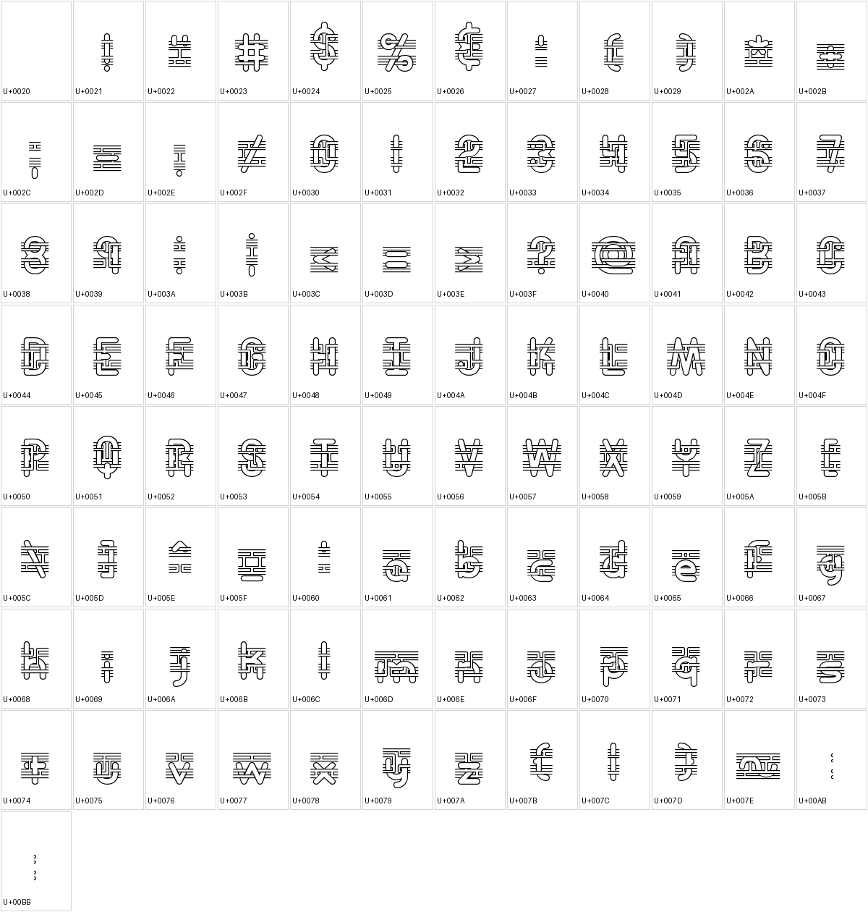 
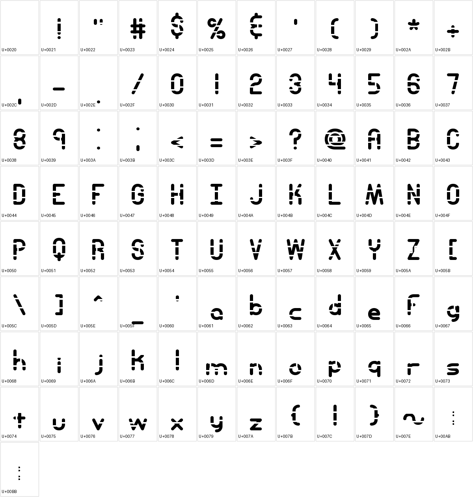 
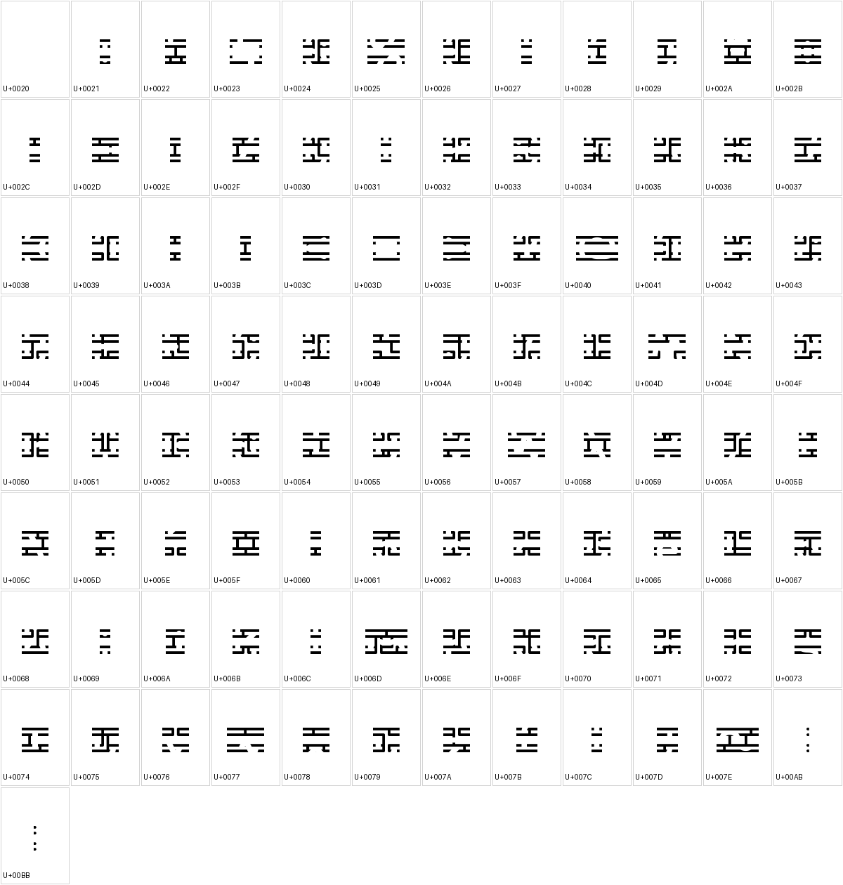 
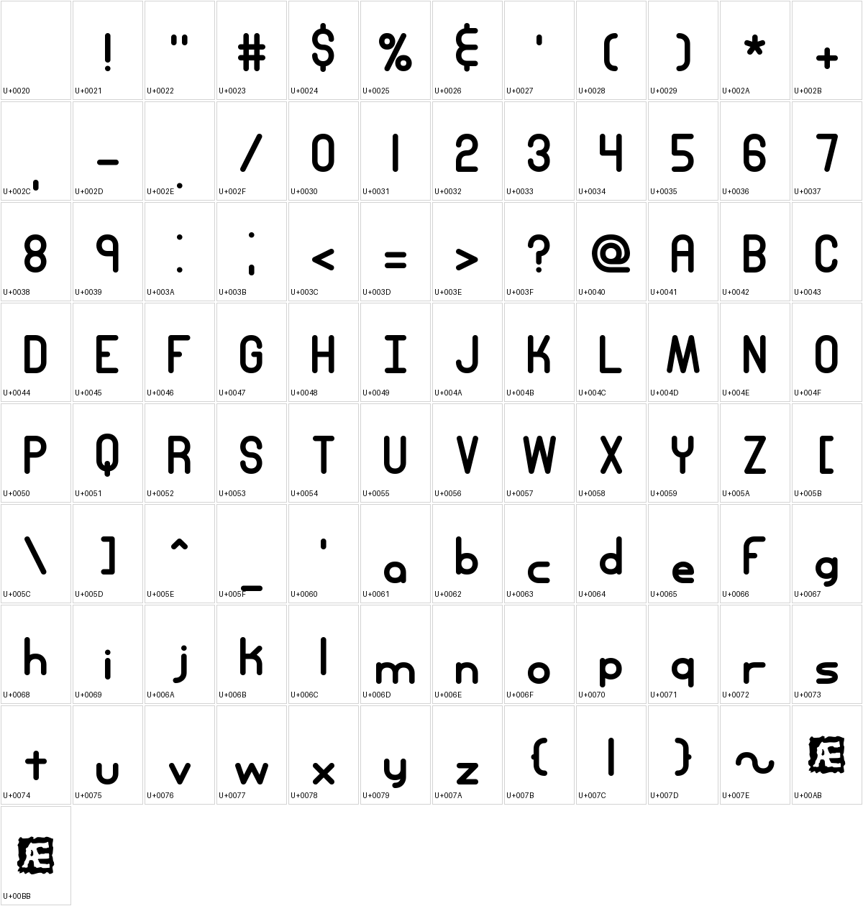


Now using the description we get the word `entanglement`.

We try many combinations of it by using Python (related words)

```Python
import itertools
import subprocess
import sys
import zipfile
import time
from pathlib import Path
from shlex import quote

ZIPNAME = "chall.zip"
OUT_TRIED = "tried_passwords.txt"

# Core keywords from the poem
KEYS = [
    "hope", "shawshank", "rock", "letter", "key",
    "photon", "photons", "entangle", "entangled", "entanglement",
    "wormhole", "wormholes", "quantum", "teleport", "teleportation",
    "anton", "zeilinger", "spooky", "spookyaction", "rita", "freedom"
]

# Separators and suffixes to try
SEPS = ["", "_", "-", "."]
SUFFIXES = ["", "2025", "_2025", "!"]

# Small leets substitutions map (optional; can increase candidates)
LEET = {
    "a": ["a", "4", "@"],
    "e": ["e", "3"],
    "o": ["o", "0"],
    "i": ["i", "1", "!"],
    "t": ["t", "7"]
}

# Controls
MAX_PAIRWISE = True   # generate pairs
MAX_TRIPLE = False    # generate triples (set True if you want more combos; slower)
MAX_ATTEMPTS = None   # cap attempts; None = unlimited

# helper utilities
def maybe_leet_variants(word, enabled=False, max_variants=12):
    """
    If enabled, produce a small set of leets variants for 'word'.
    Keep number of variants bounded to avoid explosion.
    """
    if not enabled:
        return [word]
    variants = set([word])
    chars = list(word)
    # try simple single-char replacements
    for i, ch in enumerate(chars):
        low = ch.lower()
        if low in LEET:
            for rep in LEET[low]:
                new = chars.copy()
                new[i] = rep
                variants.add("".join(new))
                if len(variants) >= max_variants:
                    return list(variants)
    return list(variants)

def generate_candidates():
    # single words
    for k in KEYS:
        for variant in maybe_leet_variants(k, enabled=False):
            for suf in SUFFIXES:
                yield variant + suf
            yield variant.title()
            yield variant.upper()

    # pairwise combos
    if MAX_PAIRWISE:
        for a, b in itertools.permutations(KEYS, 2):
            # avoid duplicates like hope_hope
            if a == b: 
                continue
            for sep in SEPS:
                base = a + sep + b
                for suf in SUFFIXES:
                    yield base + suf
                yield base.title()
                yield base.upper()

    # triple combos (optional; can explode)
    if MAX_TRIPLE:
        for a, b, c in itertools.permutations(KEYS, 3):
            if a == b or b == c or a == c:
                continue
            for sep in SEPS:
                base = a + sep + b + sep + c
                for suf in SUFFIXES:
                    yield base + suf
                yield base.title()

def try_with_zipfile(pw: str):
    """Attempt extraction with Python zipfile. Returns True on success, False otherwise."""
    try:
        with zipfile.ZipFile(ZIPNAME) as z:
            # Try to extract a single file to memory first (safer)
            # Some zips require reading a member to confirm password; try a small member
            names = z.namelist()
            if not names:
                return False
            # attempt to read first member
            z.read(names[0], pwd=pw.encode('utf-8'))
            # If read succeeded without exception, password likely correct. Now attempt full extract safely to a folder.
            outdir = f"extracted_with_{pw}"
            z.extractall(path=outdir, pwd=pw.encode('utf-8'))
        print(f"[zipfile] Extracted successfully to: {outdir}")
        return True
    except RuntimeError:
        # wrong password triggers this
        return False
    except zipfile.BadZipFile:
        print("[zipfile] BadZipFile or unsupported format")
        return False
    except Exception as e:
        # zlib decompression errors or other exceptions mean password was wrong or unsupported compression
        # print minimal debug info, but keep going
        # print(f"[zipfile] Exception for pw {pw!r}: {e}")
        return False

def has_7z():
    """Return True if 7z is available on PATH."""
    for cmd in ("7z", "7za", "7zr"):
        try:
            subprocess.run([cmd], stdout=subprocess.PIPE, stderr=subprocess.PIPE, timeout=1)
            return cmd
        except Exception:
            continue
    return None

def try_with_7z(pw: str, sevenz_cmd: str):
    """Attempt extraction using 7z. Returns True on success."""
    outdir = f"7z_extracted_{pw}"
    cmd = [sevenz_cmd, "x", "-y", f"-p{pw}", ZIPNAME, f"-o{outdir}"]
    try:
        proc = subprocess.run(cmd, stdout=subprocess.PIPE, stderr=subprocess.PIPE, timeout=20)
        stdout = proc.stdout.decode(errors="ignore")
        stderr = proc.stderr.decode(errors="ignore")
        # 7z prints "Everything is Ok" on success
        if "Everything is Ok" in stdout or proc.returncode == 0:
            print(f"[7z] Extracted successfully to: {outdir}")
            return True
        # some versions return 0 but still no "Everything is Ok" - check output for "Wrong password" patterns
        if "Wrong password" in stdout or "Wrong password" in stderr:
            return False
        return False
    except Exception as e:
        # timed out or not available
        return False

def main():
    zip_path = Path(ZIPNAME)
    if not zip_path.exists():
        print("Could not find", ZIPNAME, "in current folder.")
        sys.exit(1)

    print("Generating candidates... this may produce many attempts.")
    sevenz_cmd = has_7z()
    if sevenz_cmd:
        print("Found 7z on PATH as:", sevenz_cmd)
    else:
        print("7z not found on PATH; script will still try Python extraction (may not support all zip encryption methods).")

    tried_file = open(OUT_TRIED, "w", encoding="utf-8")
    attempts = 0
    start = time.time()
    try:
        for pw in generate_candidates():
            attempts += 1
            tried_file.write(pw + "\n")
            if MAX_ATTEMPTS and attempts > MAX_ATTEMPTS:
                print("Reached attempt cap", MAX_ATTEMPTS)
                break
            if attempts % 100 == 0:
                elapsed = time.time() - start
                print(f"[{attempts}] tried, elapsed {elapsed:.1f}s, last pw: {pw}")

            # quick sanitation: skip obviously short non-meaningful tokens
            if len(pw) < 2:
                continue

            # First try with zipfile
            ok = try_with_zipfile(pw)
            if ok:
                print("SUCCESS (zipfile) password:", pw)
                return

            # fallback to 7z if available
            if sevenz_cmd:
                ok2 = try_with_7z(pw, sevenz_cmd)
                if ok2:
                    print("SUCCESS (7z) password:", pw)
                    return

        print("Exhausted candidates generation without finding a valid password.")
    finally:
        tried_file.close()

if __name__ == "__main__":
    main()
```
We get the password as `quantum_entanglement`

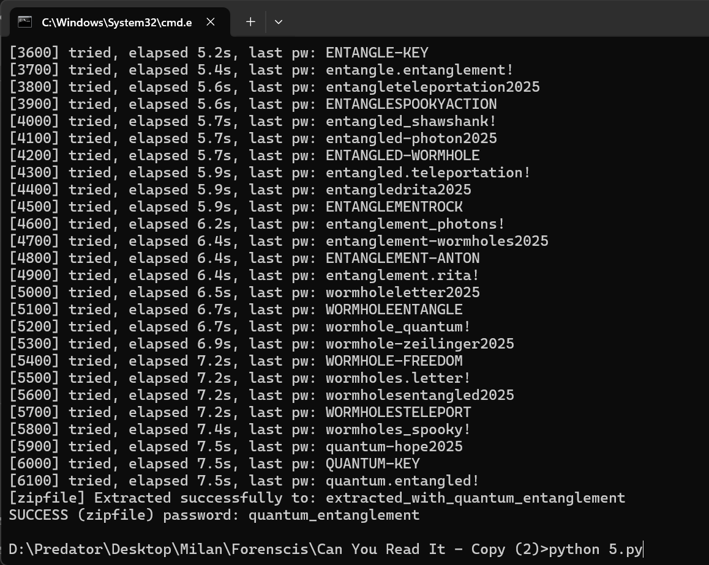

Using `quantum_entanglement` as password for the Zip we can extract the file.

This gives us `final.png`

Now using `stegsolve` and going to blue plane 0 we can see

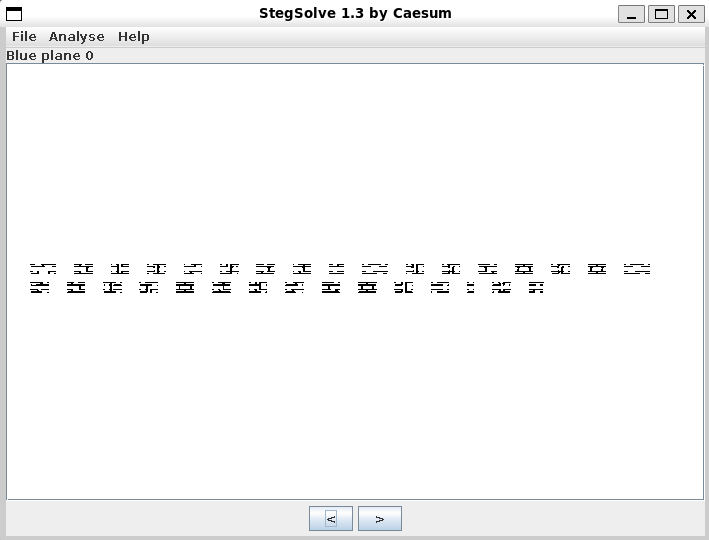


Now manually comparing both will give us the flag.


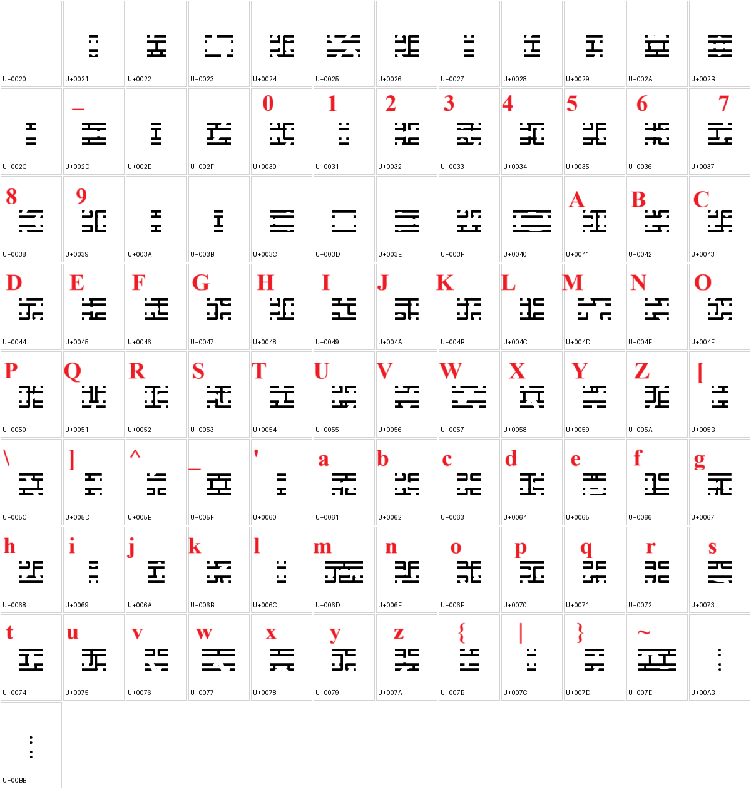

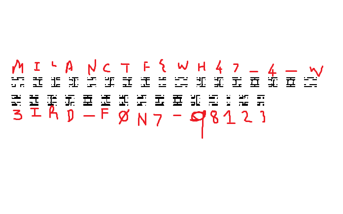

The flag format is `milanctf25{...}`

So using the updated format we get `milanctf25{wh47_4_w3ird_f0n7_9812}`